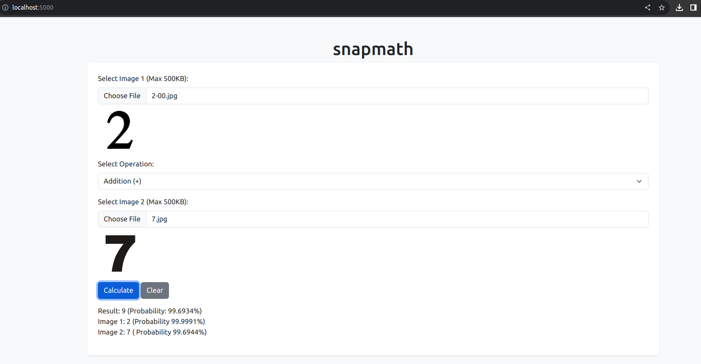
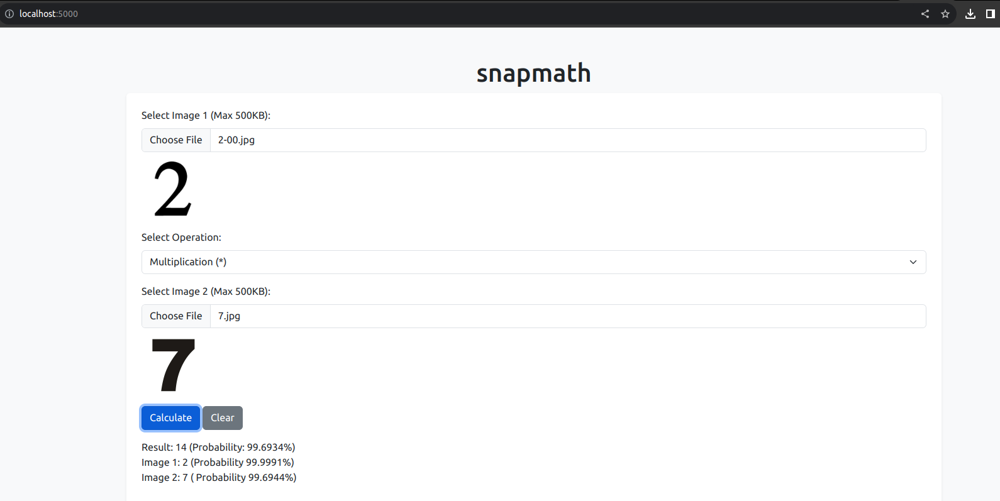
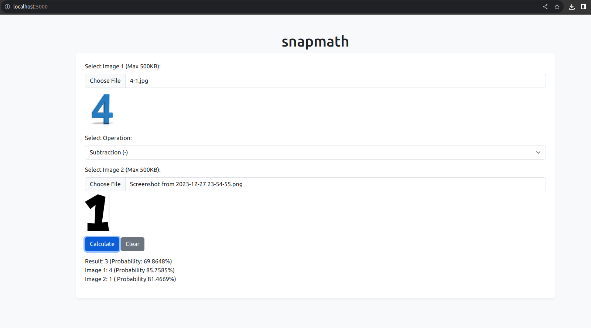
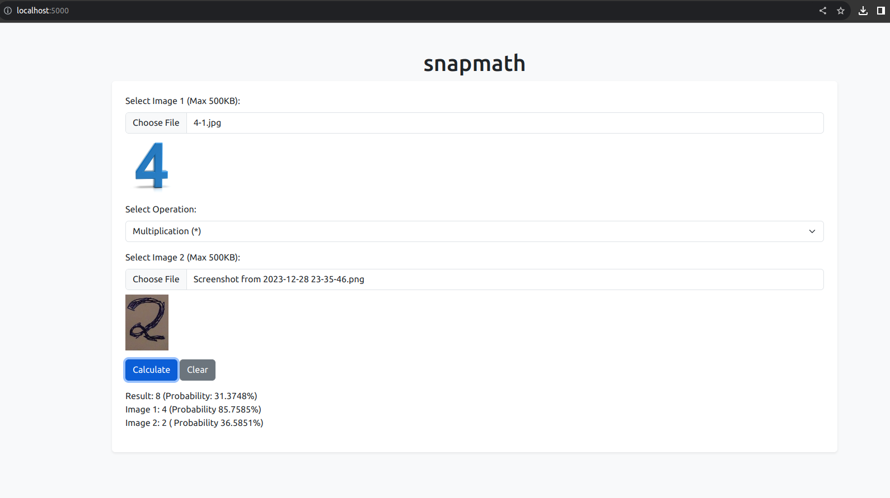
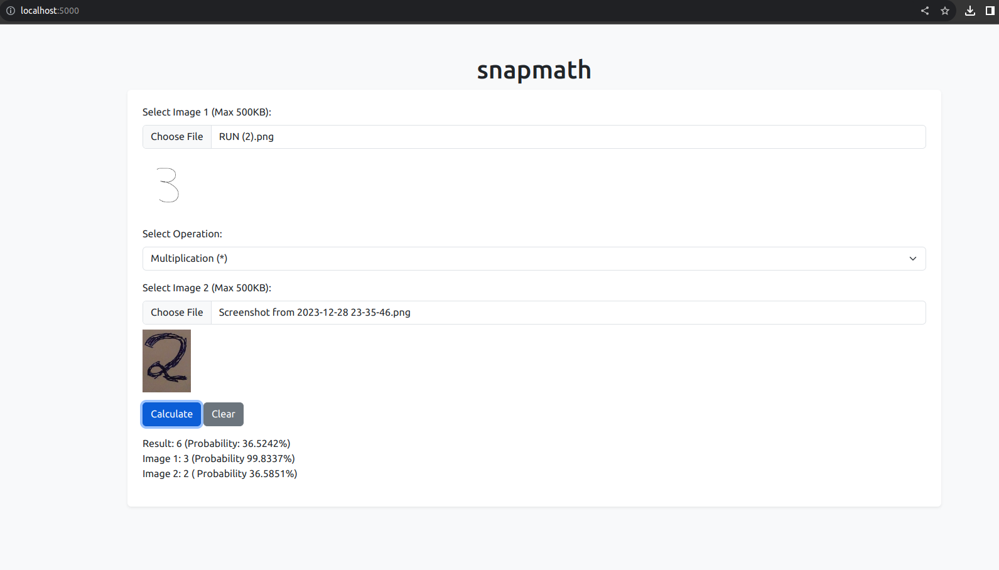
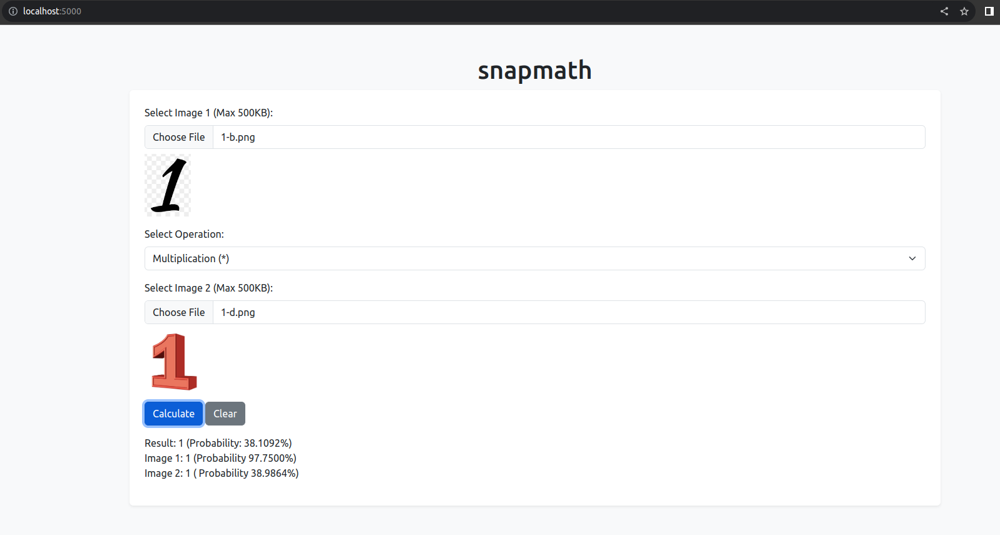
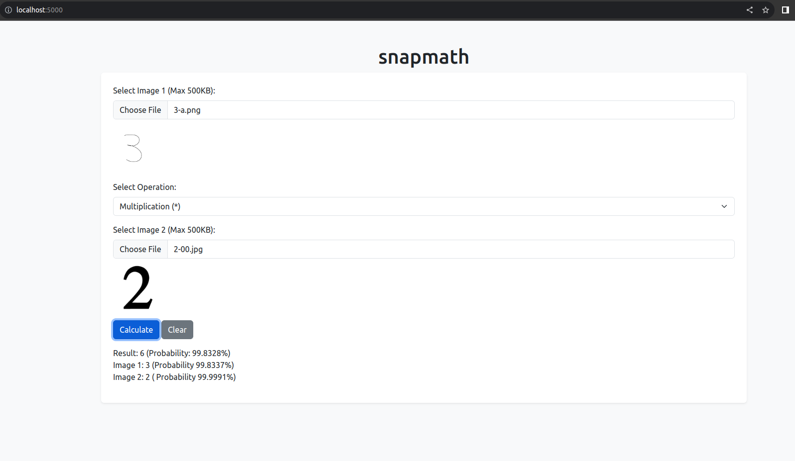

# snapmath

## Project TOC
1. [Just want to run the project](#running-from-docker);
2. [The app in action](#app-in-action);
3. [Design Document](./design-doc.md);
4. [Jupyter Notebook of model](./machine-learning/snapmath.ipynb);
5. [App local development (Python)](#running-python-app-from-source-code);
6. [App local development (React)](#running-react-app-from-source-code);
7. [Saving a built and trained model](#saving-a-built-and-trained-mode);
8. [Exposing the model on Tensorflow serving](#exposing-the-model-using-tensorflow-serving);
9. [Next steps](#next-steps);
10. [Contribution](#contribution);

## Running from docker

```sh
docker run -p 5000:5000 -e MODEL_PATH="./models/1703825980" buarki/snapmath-app
```

Once running go to http://localhost:5000. You can find some images to use at the ML directory.

## App in action










## Running Python app from source code

To develop the app you can follow this steps:

1. enter the app directory:

```sh
cd app
```

2. Initialize virtual env:

```sh
python3 -m venv app/snapmath
```

3. Activate the virtual env:

```sh
source snapmath/bin/activate
```

4. Install dependencies:

```sh
pip3 install -r requirements.txt
```

5. To Run the app:

```sh
MODEL_PATH="../models/1703825980" python3 -m flask run --host=0.0.0.0
```

MODEL_PATH is pointing to the saved model [1703825980](./models/1703825980/).

Once running go to http://localhost:5000. You can find some images to use at the [ML directory](/machine-learning/numbers/).

## Running React app from source code

To develop the app you can follow this steps:

1. enter the app directory:

```sh
cd app-js
```

2. Set Node version to 19.0.0:

```sh
nvm 19.0.0
```

3. Install dependencies:

```sh
npm i
```

4. Run

```sh
npm run dev
```

Once running go to http://localhost:3000. You can find some images to use at the [ML directory](/machine-learning/numbers/).

## Saving a built and trained mode

You can collect and save your built model by using this script. Just follow bellow steps:
1. Collect the path of the model inside jupyter notebook. You can do so by running:

```sh
docker-compose exec jupyter-notebook sh -c "ls -td snapmath-model/* | head -n 1"
```

2. Get the base path of the jupyter container:

```sh
docker-compose exec jupyter-notebook pwd
```

3. Get the container id of jupyter notebook:

```sh
docker ps | grep "jupyter-notebook" 
```

If you are using docker-compose you can also use the container name;

4. Now call the script [collect-model.sh](./collect-model.sh) proving these arguments:

```sh
./collect-model.sh jupyter-notebook CONTAINER_BASE_PATH/MODEL_PATH
```

A concrete example is bellow one:

```sh
./collect-model.sh 2c40e8ce7197 /home/jovyan/snapmath-model/1703825980
```

where:
- 2c40e8ce7197 is the container jupyter notebook container id
- /home/jovyan/snapmath-model/1703825980 is the new model to be saved

## Exposing the model using TensorFlow Serving
In order to see a trained model running performing the inferences, we can leverage [TensorFlow Serving](https://www.tensorflow.org/tfx/serving/architecture), which is a prepared docker image able to load the model and make it available via REST or gRPC. The [Makefile](./Makefile) already has a command to expose a collected model in it. First, we need to build the image based on the [provided Dockerfile](./tensor-flow-serving/Dockerfile) adding the [collected models](./models/) inside of it:

```sh
make build-tf-serving
```

Then we can run:

```sh
make run-tf-service
```

The REST API will be available at localhost:8501, and you can easily call this API using the [provided client using Jupyter Notebook](./machine-learning/tensorflow-serving-client.ipynb).

## Next steps
For now I see two interesting points to inspect:
- Check if is it possible to run this model using Go;

## Contribution

Contributions are welcome!
If you find something interesting to improve just open a PR :)
