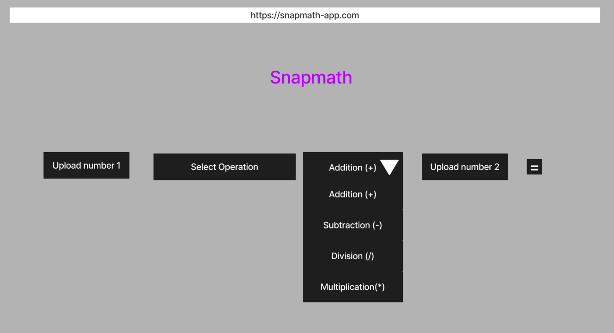
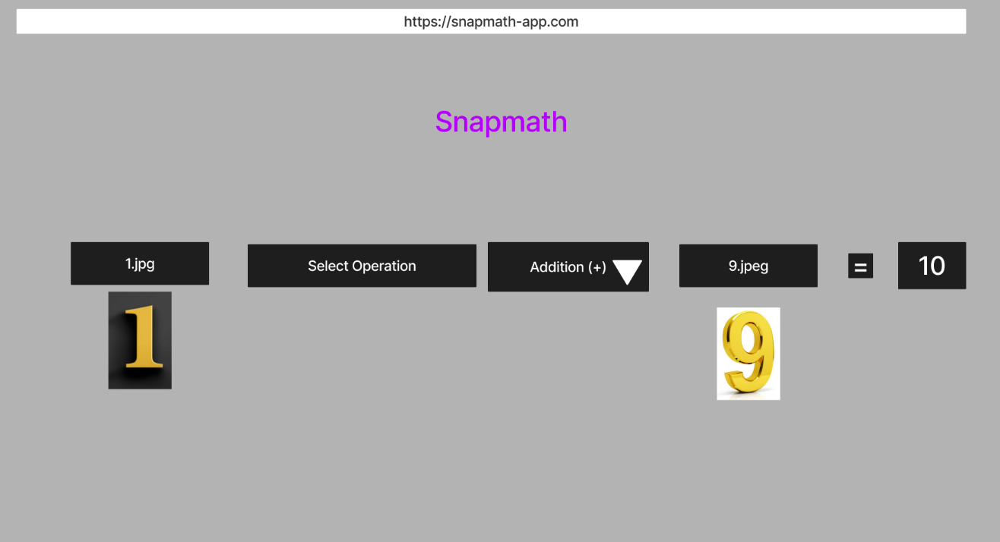
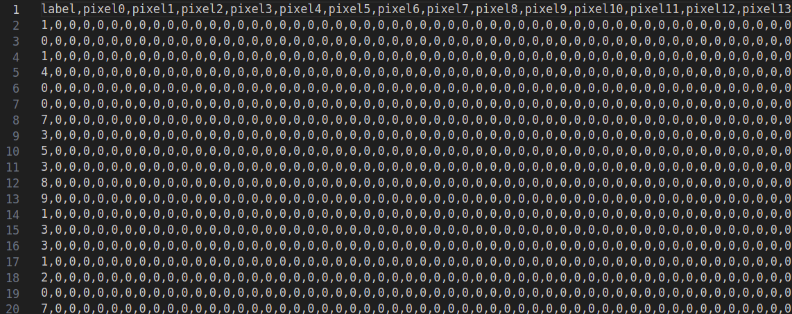
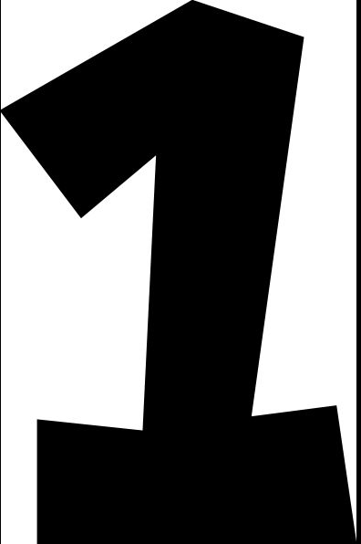
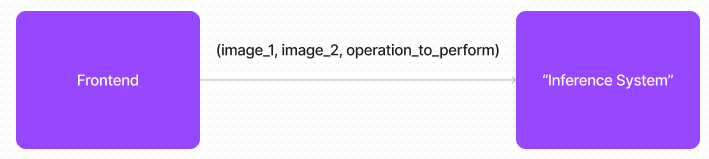
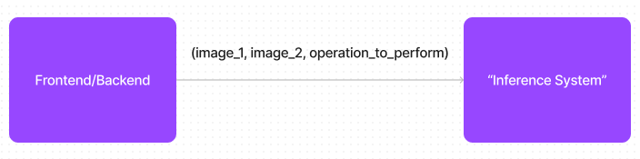
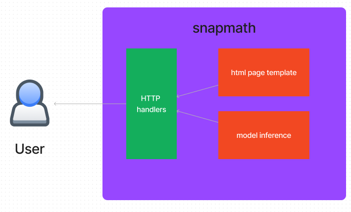

# snapmath Design Document

### Version: 1

## TOC

- [1.Context Overview](#1-context-overview);
- [2. Goals of this project](#2-goals-of-this-project);
- [3. Functional Requirements](#3-functional-requirements);
- [4. Non-functional requirements](#4-non-functional-requirements);
- [5. Assumptions](#5-assumptions);
- [6. Limitations](#6-limitations);
- [7. Dependencies](#7-dependencies);
- [8. Challenges Ahead](#8-challenges-ahead);
- [9. Building the model](#9-building-the-model);
  - [9.1. Introduction](#91-introduction);
  - [9.2. MNIST dataset](#92-mnist-dataset)
  - [9.3. Extracting features: Convolutional Neural Networks](#93-extracting-features-convolutional-neural-networks);
  - [9.4. Learning from the features: Fully Connected Networks
](#94-learning-from-the-features-fully-connected-networks);
  - [9.5. Refining hyperparameters and layer's input/output shape
](#95-refining-hyperparameters-and-layers-inputoutput-shape);
- [10. Deploying the model to be used: MLOps in action
](#10-deploying-the-model-to-be-used-mlops-in-action);
  - [10.1. Introduction](#101-introduction);
  - [10.2. Assessing the architectural options](#102-assessing-the-architectural-options);

## 1. Context Overview

The snapmath project aims to be a funny way to warm up myself in the trending *Machine Learning (ML)* world after some time revisiting the topic. It'll be done by having a practical experience on the very process of developing an ML-based app, by planning the model, training it to ensure a good accuracy, exporting the model and make it available to a regular user.

My humble idea to accomplish such challenge is creating an app that can be run on a browser where one could upload two pictures of **single digits numbers**, select a basic math operations like sum, subtraction, division and multiplication and get the result on the screen. Such idea came once I got a suggestion of a friend to build a model to understand handwritten digits using a free available dataset called [MNIST](https://www.kaggle.com/datasets/hojjatk/mnist-dataset) which contains a series of handwritten digits images labeled with corresponding single digit number. Thus, if I successfully create a model using such dataset I could extend it to a more funny purpose rather than just be predicting random numbers :)

An overview of how the app should look like can be seen on the images below (and please don't envy my prototyping skills):

And once images of numbers are loaded and user hits button `=`:

## 2. Goals of this project
- Understand the process of building a model from scratch using [TensorFlow](https://www.tensorflow.org);
- Get acquainted with [Jupyter notebook](https://jupyter.org/) as it is a widely used tool in by the industry;
- Get acquainted with strategies to deploy Machine Learning models once trained, such as [TensorFlow Serving](https://www.tensorflow.org/tfx/serving/architecture);

## 3. Functional Requirements
- One user must select two image of single digit numbers to perform a simple math operation (+, *, / -), press "=" and get the result;
- System needs to run for free;

## 4. Non-functional requirements
- Support jpg, jpeg, png image formats (basic formats);
- Image max allowed size must be 500KB;

## 5. Assumptions
- It won't be used in large scale, it is just a small machine learning project;
- It will be used on desktop or smarthphone;

## 6. Limitations
- As the model will be built based on MNIST, we will support only single-digit numbers—0 to 9, at least for this version ;)
- As the image will be shrunk to a 28x28 shape, depending on how big the picture is it might get too blurred and the prediction might be affected;

## 7. Dependencies
- [MNIST dataset](https://www.kaggle.com/datasets/hojjatk/mnist-dataset);
- [Jupyter notebook](https://jupyter.org/);
- [TensorFlow](https://www.tensorflow.org);

## 8. Challenges ahead
- Deploy the "web site" without costs;
- Provide a simple, minimalist and effective UI for users;

## 9. Building the model

### 9.1. Introduction

This part will probably be the most challenging. It'll involve getting the dataset, planning the neural net topology, building, evaluating, and then exporting the model.

### 9.2. MNIST dataset

As mentioned before, the dataset used will be MNIST, which includes a collection of handwritten digits along with their associated numbers. The dataset comprises square images of 28 pixels in width and 28 pixels in height, organized in a CSV (Comma Separated Values) file as a flattened vector of length 784 pixels, with a column indicating the associated digit. A quick overview of how this dataset looks, showing the label and the first 14 pixels (from 0 to 13), can be seen in the image below:

### 9.3. Extracting features: Convolutional Neural Networks

Due to the fact that numbers can be drawn in different ways, one relevant aspect to plan the Neural Network is the **translation invariance**, because the app may be fed with a plenty of different forms of number 1s, thus, different forms of invariaces, like size, perspective and lighting. Bellow images might give an example of this.

To effectively extract features that enable the identification of a "1" regardless of these variabilities, we employ convolutional neural networks (CNNs). The convolutional layers in CNNs are adept at scanning local regions of the input images, enabling the network to learn hierarchical features. This is particularly valuable for capturing essential patterns despite variations in appearance.

And to further make this feature extraction consistent we can combine the convolutions with **pooling** as it helps in creating a more abstract representation of the input, making the model less sensitive to the exact spatial location of features. This means that even if the position, size, or lighting conditions of a drawn "1" differ, the CNN's feature extraction mechanism remains consistent, facilitating accurate identification.

Thus, the first part of the Neural Network will be in charge of detecting and collecting the features from the images and giving them on a vector. Such vector then will be fed into a regular fully connected Neural Network to perform the learning.

### 9.4. Learning from the features: Fully Connected Networks

Once the features that makes a "1" be a "1" are found we can pass it into a fully connected Neural Network and peform the training adjusting the weights untill it starts giving accurate predictions of which number the image is corrsponding.

### 9.5. Refining hyperparameters and layer's input/output shape

Defining the proper hyperparameters such as **learning** rate and the shape of input and output of each layer is a crucial part of the Neural Network topology. To do so I'll perform some benchmarking with the help of ChatGPT, which will be my mate and assistant during this project :)

## 10. Deploying the model to be used: MLOps in action

### 10.1. Introduction

Wraping the built and trained model into an usable app will be the last step of this project. In this section we'll discuss what we will use and why in order to make it aviable.

### 10.2. Assessing the architectural options

For sure we'll need some way to deliver a frontend application with a minimal Javascript to be able to get loaded images and ask to some server what the answear is. We can visualize it with bellow image:

**The point to decide here is how the "Inference System" will work**. From a previous research we could see that Google provides a tool called [TensorFlow Serving](https://www.tensorflow.org/tfx/serving/architecture), which is a Docker image that is able to load a built model and serve it through a REST or gRPC API out of the box.

The point that makes TensorFlow Serving not suitable for this project is that it requires the input image to have have 28 pixels of width by 28 pixels of height in grayscale, we can't expect all images to be in such format :)

Thus, before inputing the images into the model we need to prepare them. Our decision to handle both the frontend serving as well as the images pre-processing will be building a Python web server using [Flask](https://flask.palletsprojects.com/en/3.0.x/) to perform both tasks. That way, the architectural overview now look like this:

From this point we stuck in two options: either deploy the built model into TensorFlow Serving and make the monolith app asks for inferences via REST or gRPC requests or also load and ship the model into the monolith app. Check bellow decision matrix:

| Aspect to consider | Load model directly on monolith  | Deploy model on Tensorflow Service |
| :---:   | :---: | :---: |
| Deployment Difficulty | Lower  | Higher   |
| Maintenance | Esier  | Requires additional maintenance and monitoring   |
| Inference Latency | Lower latency due to direct model access  | Slightly higher latency due to communication with a separate service   |
| Model Updates	 | Requires redeployment of the entire backend	  | Allows for independent updates and rollbacks of the serving service  |

Considering above aspects and the requirement that the project must run for free we'll proceed with the monolith solution we'll be able to serve the very application using a "single deployment". Thus, the final application overview is the following:

